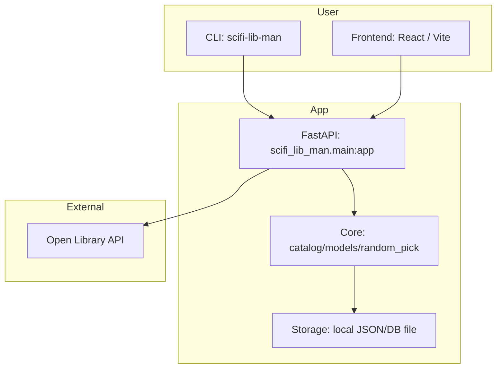

# scifi-lib-man
Personal Science Fiction Library Manager. Organize a reading list of Hugo/Nebula/Locus/Pulitzer/Booker/Nobel award winners, track read/unread status, and get random unread picks. Includes a FastAPI endpoint to query Open Library.

See `AGENTS.md` for repo-specific contributor/agent instructions.

## Architecture


Design docs: [docs/ai-similarity.md](docs/ai-similarity.md)

## Features
- CLI scaffold (Typer)
- FastAPI app with `/health`, `/books/search`, `/books/quick-search`, `/books/isbn/{isbn}`, `/books/{olid}`, `/works/{olid}`, `/authors/{olid}`, `/books/awards/{award}/search`
- Similar works (SSE): `/works/similar/stream`
- Reading list API: `/reading-list` (GET), `/reading-list/{olid}` (POST/PUT/DELETE)
- Open Library search + ISBN detail lookup
- Dependency sync from `pyproject.toml`

## Requirements
- Python >= 3.9

## Setup
Create a virtual environment and install dev dependencies:
```
python -m venv .venv
source .venv/bin/activate
pip install -e .[dev]
```

## Run the API
```
uvicorn scifi_lib_man.main:app --reload
```

## Similar Works (Local Setup)
The similarity search uses Ollama embeddings and ChromaDB persistence.

```
export SCIFI_EMBEDDING_MODEL=embeddinggemma
export SCIFI_CHROMA_COLLECTION=works_v1_embeddinggemma
export SCIFI_CHROMA_PERSIST_DIR=data/chroma
```

Install and run Ollama, then pull the embedding model:
```
ollama pull embeddinggemma
```

The CLI uses `SCIFI_API_BASE` to target a non-default API host.
Set `SCIFI_LOG_SIMILARITY=1` to print top match reasons on the server.

### Example requests
```
curl "http://127.0.0.1:8000/health"
curl "http://127.0.0.1:8000/books/search?author=Ayn%20Rand&limit=5"
curl "http://127.0.0.1:8000/books/quick-search?q=dune"
curl "http://127.0.0.1:8000/books/search?subject=cyberpunk&subject_key=science_fiction&language=eng"
curl "http://127.0.0.1:8000/books/search?year_from=1990&year_to=1999"
curl "http://127.0.0.1:8000/books/isbn/9780143111580"
curl "http://127.0.0.1:8000/books/OL27448M"
curl "http://127.0.0.1:8000/works/OL45804W"
curl "http://127.0.0.1:8000/authors/OL23919A"
curl -X POST "http://127.0.0.1:8000/reading-list/works/OL45804W" \
  -H "Content-Type: application/json" \
  -d '{"status":"wishlist"}'
curl "http://127.0.0.1:8000/reading-list?status=wishlist"
curl -X PUT "http://127.0.0.1:8000/reading-list/works/OL45804W" \
  -H "Content-Type: application/json" \
  -d '{"status":"read","rating":5}'
curl -X DELETE "http://127.0.0.1:8000/reading-list/works/OL45804W"
curl "http://127.0.0.1:8000/books/awards/hugo/search?author=Ursula%20Le%20Guin&year=1969"
curl "http://127.0.0.1:8000/books/awards/nebula/search?year_from=1990&year_to=1999"
curl "http://127.0.0.1:8000/books/awards/hugo/search?subject=cyberpunk&subject_key=science_fiction&language=eng"
curl "http://127.0.0.1:8000/books/awards/locus/search?title=Neuromancer"
curl "http://127.0.0.1:8000/books/awards/pulitzer/search?title=The%20Grapes%20of%20Wrath"
curl "http://127.0.0.1:8000/books/awards/booker/search?author=Yann%20Martel"
curl "http://127.0.0.1:8000/books/awards/nobel/search?q=literature"
```

## Run the CLI
```
scifi-lib-man --help
scifi-lib-man hello
scifi-lib-man health
scifi-lib-man init-db
scifi-lib-man add /works/OL45804W --status wishlist
scifi-lib-man list --status wishlist
scifi-lib-man remove /works/OL45804W
scifi-lib-man similar /works/OL45804W
```

## Frontend UI
The React UI lives in `frontend/`.

```
cd frontend
npm install
npm run dev
```

By default it calls `http://127.0.0.1:8000`. Override with:
```
VITE_API_BASE=http://127.0.0.1:8000 npm run dev
```

## Tests
```
pytest
```

## Development
Sync `requirements.txt` from `pyproject.toml`:
```
make sync-requirements
```

Dev dependencies are captured in `requirements-dev.txt` when synced.
