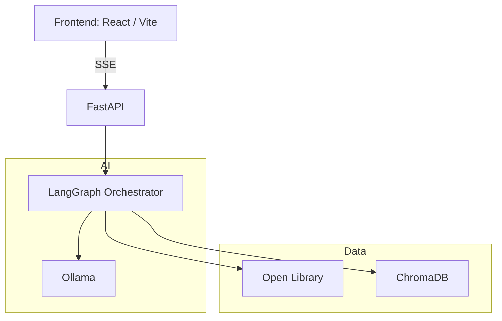
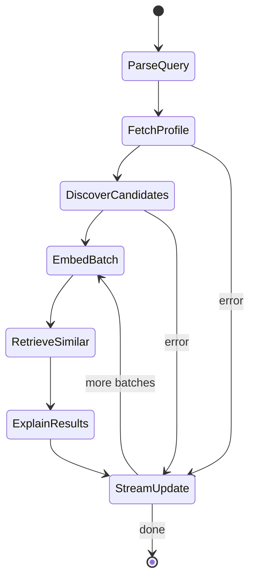

# AI Similarity Search Design

## Purpose
Enable "similar works" search for any title using local, agentic retrieval with streaming updates. Results improve as the system indexes more candidates in real time.

## Scope (MVP)
- Similarity by content, not cover art.
- Live indexing on first request (no precompute).
- SSE updates from the backend to the UI.
- Optional toggle to prefer the same author.

## Architecture


## Data Model (ChromaDB)
One record per Work. The embedding is computed from a composed "work profile" string. Metadata is stored for display and optional reranking. Editions should be normalized to their parent Work when possible.

**Document text (embedded)**
```
Title: Dune
Authors: Frank Herbert
Description: Epic science fiction novel about politics, ecology, and religion on a desert planet.
Subjects: science fiction, space opera, ecology, desert planet, political intrigue
Subject places: Arrakis
Subject people: Paul Atreides
Subject times: far future
Awards: Hugo, Nebula
Year: 1965
```

**Metadata (stored with the vector)**
- `id`: Open Library Work ID (canonical)
- `title`
- `authors` (list)
- `subjects` (list)
- `subject_places` (list)
- `subject_people` (list)
- `subject_times` (list)
- `awards` (list)
- `year` (normalized; Work endpoint `first_publish_date` or Search endpoint `first_publish_year`)
- `olid` (work id)
- `source`: `search` | `award` | `similar`
- `indexed_at`

## Agent Workflow (LangGraph)



### Nodes
- **ParseQuery**: normalize title or OLID
- **FetchProfile**: Open Library lookup and profile text creation
- **DiscoverCandidates**: subject and keyword search to find candidates
- **EmbedBatch**: embed and upsert a batch into ChromaDB
- **RetrieveSimilar**: query ChromaDB by embedding
- **ExplainResults**: short reasons for matches (lightweight metadata-based)
- **StreamUpdate**: emit SSE updates

## SSE Contract
Events are streamed during indexing and ranking.

**status**
```json
{ "phase": "fetch_profile", "message": "Fetching metadata" }
```

**progress**
```json
{ "embedded": 40, "total": 240, "batch_size": 20 }
```

**results**
```json
{
  "items": [
    {
      "id": "OL12345W",
      "title": "Foundation",
      "authors": ["Isaac Asimov"],
      "year": 1951,
      "score": 0.87,
      "reason": "Empire scale politics; long historical arc",
      "subjects": ["science fiction", "galactic empire"]
    }
  ],
  "refined": true
}
```

**error**
```json
{ "message": "Open Library lookup failed", "recoverable": true }
```

**done**
```json
{ "total_candidates": 240, "embedded": 240, "final_count": 10 }
```

## Ranking (No Code)
A weighted score balances semantic similarity with metadata boosts.

```
final = 0.70 * embedding_similarity
      + 0.15 * subject_overlap
      + 0.10 * awards_overlap
      + 0.05 * year_proximity

if prefer_same_author:
  final += author_boost

if prefer_year_range:
  final += year_range_boost
  final -= year_proximity
```

Notes:
- Subjects, awards, and year appear in the embedding text and are also used as small boosts.
- Author boost is optional and controlled by a UI toggle.
 - Reasons are derived from shared subjects/awards, era proximity, and same-author matches (when enabled).

## UX Flow
1) User clicks "Similar works"
2) UI opens SSE stream and shows progress
3) Results appear after first batch embeds
4) Results update as more candidates are indexed
5) Final list is marked as "refined"

## MVP Limits
- Candidate cap per request (example: 200 to 300)
- Batch size (example: 20 to 50)
- Time budget (example: 10 to 15 seconds)

## Operational Considerations (MVP Defaults)
- **Model choice**: start with a single embedding model and one lightweight LLM for explanations. Keep it configurable.
- **Caching**: store embeddings on disk (ChromaDB persistence). Skip re-embedding if Work ID already exists.
- **Concurrency**: limit concurrent embedding jobs (example: 1 to 2) to avoid saturating local Ollama.
- **Failure modes**: emit SSE `error` events with a friendly message and allow retry. If SSE cannot be established, return 503.
- **Deduping**: normalize and dedupe candidates by Work ID to avoid duplicate editions.
- **Language**: default to English filter; store language for future filtering.
- **Privacy**: all inference and embeddings are local; only Open Library is remote.

### Config Defaults
Store the embedding model and collection name in config so they can change without code edits:
```
SCIFI_EMBEDDING_MODEL=embeddinggemma
SCIFI_CHROMA_COLLECTION=works_v1_embeddinggemma
SCIFI_CHROMA_PERSIST_DIR=data/chroma
SCIFI_LOG_SIMILARITY=1
```

### Retry and Backoff
- Open Library search and embedding calls use a small retry loop.
- Default: up to 3 attempts with linear backoff (0.5s or 0.6s base delay).
- Keep retry counts low to avoid blocking the SSE stream for too long.

## Local Dev Setup (Ollama)
Ollama runs a local HTTP server by default at `http://localhost:11434/api`. Use it for embeddings during development.

### macOS Install
- Option A (Homebrew CLI):
```
brew install ollama
brew services start ollama
```
- Check status:
```
brew services list
```
- Stop:
```
brew services stop ollama
```
- Option B (Homebrew GUI app):
```
brew install --cask ollama-app
```
- Option C (direct app download): install the Ollama macOS app, then launch it once so it can set up the CLI.
- Verify:
```
ollama list
```

### Pull an Embedding Model
Ollama recommends these embedding models for similarity search: `embeddinggemma`, `qwen3-embedding`, `all-minilm`.
For MVP, standardize on `embeddinggemma` because it is a recommended embedding model in Ollama and offers a good quality/latency balance on local hardware.

**Alternatives**
- `all-minilm`: fastest and lightest. Good for real-time responsiveness, but typically lower semantic quality than larger models.
- `qwen3-embedding`: strong general-purpose embeddings, potentially higher quality, but may be heavier and slower on local machines.

```
ollama pull embeddinggemma
```

### Test the Embeddings API
```
curl -X POST http://localhost:11434/api/embed \
  -H "Content-Type: application/json" \
  -d '{
    "model": "embeddinggemma",
    "input": ["Example text 1", "Example text 2"]
  }'
```
The `/api/embed` endpoint returns embeddings for the input text.

### Docker (Optional)
If you want Ollama in Docker, run the official container and expose port `11434`.

```
docker run -d -v ollama:/root/.ollama -p 11434:11434 --name ollama ollama/ollama
```

## Language Handling
- Default to English by setting a language filter when querying Open Library.
- Keep the request option `language` in the boundary contract so a future UI dropdown can pass one or more language codes.
- Store `language` in Work metadata so results can be filtered or reranked later.
- Use ISO 639-2 language codes (e.g., `eng`) for Open Library queries.
- Future UI can allow multi-select and map to multiple language codes.

## Production Option (Amazon Bedrock)
For production, a managed embedding model can replace Ollama. Amazon Bedrock offers Titan Text Embeddings V2, which can be invoked via the Bedrock Runtime API.

**Example (Python, boto3)**
```python
import json
import boto3

client = boto3.client("bedrock-runtime", region_name="us-east-1")
model_id = "amazon.titan-embed-text-v2:0"

payload = {"inputText": "Title: Dune\nAuthors: Frank Herbert\nDescription: ..."}
response = client.invoke_model(modelId=model_id, body=json.dumps(payload))

model_response = json.loads(response["body"].read())
embedding = model_response["embedding"]
```

## Why LangGraph (Workflow Orchestrator)
LangGraph models the pipeline as a state machine (nodes and edges). It is not required for MVP, but it helps with:
- retries and branching (example: broaden search when candidates are too few)
- streaming updates between steps
- a clean place to add new steps later (rerank, explanations, fallbacks)

If needed, a simple MVP can start as plain Python + background tasks and migrate to LangGraph later.

## SSE vs WebSocket (Why SSE)
- SSE is one-way (server → client) and fits streaming progress/results.
- WebSockets are full-duplex and add complexity when the client doesn't need to send messages.
- SSE works over standard HTTP with native browser `EventSource`.

## CLI Usage (Similarity)
You can stream similar works from the CLI (requires the API server running):
```
scifi-lib-man similar /works/OL45804W
```

### Planned Nodes
- **ParseQuery**: normalize title or OLID
- **FetchProfile**: Open Library work lookup and profile creation
- **DiscoverCandidates**: search candidates by subjects/keywords
- **EmbedBatch**: embed and upsert a batch into ChromaDB
- **RetrieveSimilar**: query ChromaDB for top-K similar works
- **ExplainResults**: short reasons for matches (optional)
- **StreamUpdate**: emit SSE events

## Boundary Contract (Monolith Now, Microservice Later)
Define a logical service boundary inside the monolith. Keep request/response schemas stable so it can be extracted later with minimal change.

### Request
- `query`: title or OLID
- `options`:
  - `prefer_same_author` (bool)
  - `prefer_year_range` (int, years)
  - `max_candidates` (int)
  - `batch_size` (int)
  - `time_budget_sec` (int)
  - `language` (optional)

### Streamed Events (SSE)
- `status`
- `progress`
- `results`
- `error`
- `done`

### Core Interface (Logical)
1) `start_similarity_stream(request) -> event_stream`
2) `ensure_embedding(work_profile) -> vector_id`
3) `search_similar(vector_id, options) -> results[]`

### Data Contracts
**WorkProfile**
- `id`, `title`, `authors`, `subjects`, `awards`, `year`, `description`

**SimilarityResult**
- `id`, `title`, `authors`, `year`, `score`, `reason`, `subjects`

**Progress**
- `embedded`, `total`, `batch_size`, `phase`

### Extraction Path
- Keep SSE in the gateway API.
- Move the agent + embeddings + Chroma logic into a new service.
- Replace the internal calls with HTTP or gRPC while preserving payloads.

## Non Goals (MVP)
- Precomputing embeddings for all works
- Image embeddings or cover similarity
- Global popularity ranking

## Open Questions
- Which Ollama embedding model to standardize on
- How much to bias toward same-author results by default
- How to surface "refined" vs "initial" results in UI
